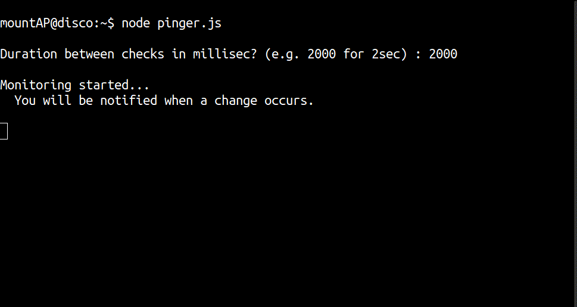

# pappuPinger
A node script that pings our university website and notifies us about changes.



### Installation

* Prerequisites
  * nodejs
  * git

  Install these using your favourite package manager if they aren’t present on your system.

* Clone the repository

  ```bash
  git clone https://github.com/mountAP/pappuPinger
  ```

* Move to the cloned folder

  ```bash
  cd pappuPinger
  ```

* Install dependencies

  ```bash
  npm install
  ```


### Start `pinger.js`

```bash
node pinger.js
```


* For 3600000 ms, the check is performed once every hour. Feel free to set it to any value. However, values below 2000 ms are not recommended.
* Rest will be self explanatory.  Don’t worry.


#### NOTE

You need not bother about connection drops, terminal crashes or device restarts. We’ve got you covered. Once started, Pinger saves a local copy of the website and compares it with the latest version in subsequent checks after restarts or network connection resets. So no change goes unnoticed regardless of whether or not you were offline for some period.

Just restart the script using `node pinger.js` inside the `pappuPinger` directory. 


#### Bonus for Termux Users

You get a system notification when a change occurs, you must have `termux-api` installed. 


#### Extending the script

You may use the script with any of the websites to monitor text changes. Just change the `url` inside `pinger.js`.  **Caution** The script may not work as expected for websites with dynamic content E.g. ‘amazon.in’.


#### Known issues

Does not detect text within `<span>` tags.


#### Project name justification

Ours is a cool University, called PPU (Patliputra University), situated at the heart of Bihar. Very affectionately, we like to call it “Pappu University” and hence the project name.